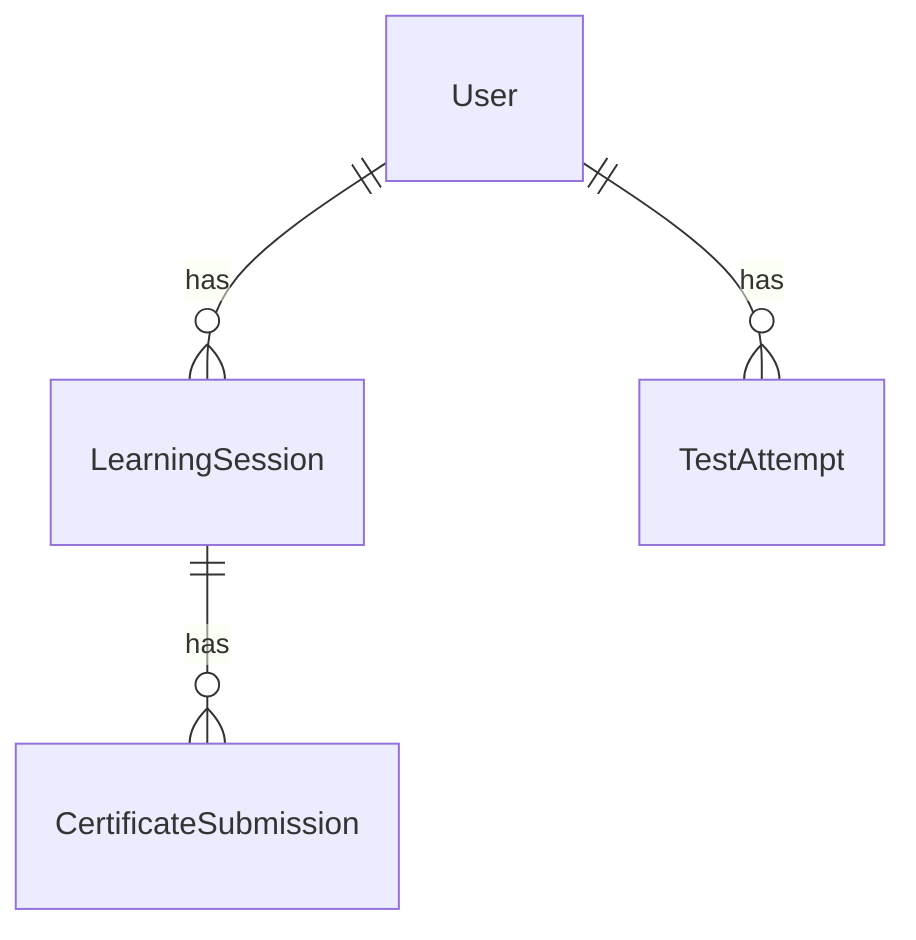

<!-- Generated from docs/intake.md by kickoff v0.1.0. Edit the intake, not this file. -->

# teacher — Architecture

## Stack

| Layer | Choice |
|---|---|
| Language | TypeScript |
| Frontend | Next.js |
| Backend | Next.js route handlers |
| Database | PostgreSQL |
| Data layer | Prisma |
| Styling | Tailwind |
| Tests | Vitest, Playwright |
| Package manager | pnpm |

Task templates: ts-prisma-postgres. Notes from the intake: Auth.js for email-and-password plus magic link. `@peculiar/x509` for parsing the certificates students upload.

## Components

### Frontend

The Next.js app: the lesson pages (certificate chains and generating a certificate; deploying it behind a reverse proxy, in the browser, and in a Java keystore), the certificate upload page, the test page, and the admin view. Lesson content is written by the developer in markdown, not authored in the app. Talks only to the API.

### API

Next.js route handlers in the same app: saving and recovering a session, marking lesson steps done, parsing and checking an uploaded certificate, scoring a test attempt, and exporting results as a file for the admin. Talks to the database through Prisma. Nothing runs Java or a reverse proxy here; the student does that on their own machine and the app verifies the outcome.

### Database

PostgreSQL through Prisma. Holds users, sessions and their step progress, certificate submissions, and test attempts.

### Email sender

Magic-link sign-in implies an outbound email per sign-in. Auth.js sends it inside the sign-in request, so there is no separate job runner. The provider is not specified: 7.1 was skipped.

## Data model

- **User**: from sign-in. Email, hashed password when set, role (student or admin). Holds the personal details named in `data.sensitive`.
- **LearningSession**: the "session" of 5.1, named to avoid a clash with the Auth.js `Session` model. Belongs to a User; when it started; which lesson steps are done; whether it is the active session or an archived one. Rule from 5.2: a student's progress, once saved, is never lost or wrong. Rule from 5.3: recoverable, and "start over" creates a new active session while the old one stays recoverable.
- **TestAttempt**: implied by 4.4 and 14.1. Belongs to a User and a LearningSession; pass or fail; the focus areas where the student fell short; when taken.
- **CertificateSubmission**: implied by 7.2 ("might need"). Belongs to a LearningSession; the uploaded certificate, what was parsed from it, and the verdict. Never holds a private key.

Fields beyond these are not specified.

## Sign-in and permissions

Methods: email and password, magic link. Auth.js with the Prisma adapter; sessions live in the database. Visitors who are not signed in can: not specified.

| Role | Can |
|---|---|
| student | Work through the lessons, save and recover a session, start over, upload a certificate for verification, take the test |
| admin | View results and progress per student; export results with focus areas |

## Integrations

| Service | Purpose | Environment variables | Account |
|---|---|---|---|
| Email sender for magic links | Deliver the sign-in link | `AUTH_RESEND_KEY`, or the Auth.js variable for whichever provider is chosen | needed; provider not specified |

## Environments and deployment

- Deployment target: Railway
- Domain: ioannisbatsios.com
- Environments: development, production
- Development database: Docker Compose
- Production secrets live in: `.env`. On Railway that means the service's variables, since `.env` is never committed.

There is no staging environment, so migrations run against production directly; every migration is preceded by a backup.

## Non-functional design notes

- A handful of staff at once, pages feel instant: no caching layer needed; certificate parsing is the only request that does real work, and it is one file at a time.
- Accessibility best effort: no per-task accessibility criterion, but lesson and test screens are built for people with no technical experience, which means plain language and one action per step.
- Current Chrome, Edge, and Firefox on desktop: no polyfills; no mobile layout in v1.
- Offline no: nothing is stored in the browser except the sign-in cookie.
- English only: no i18n layer.
- Personal details stored: passwords hashed with argon2, HTTPS in production, uploaded certificates checked for and stripped of private keys before storage.
- Business hours uptime: a single Railway service with no redundancy is enough.

## Conventions in force

- Default branch protected: true
- Branch prefixes: feature, fix, chore
- Commit style: conventional
- `.env.example` maintained: true
- Database backup before every migration: true
- Handoff docs: true
